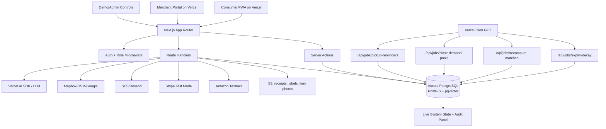

# UseBy + DemandPool Full Implementation Orchestration Plan v1

## 0. Purpose

This document turns the UseBy PRD and live-execution addendum into an orchestration-ready build plan. It is written so a master Codex session can split the work into isolated lanes, launch worktree sessions, review/merge in dependency order, and verify the product end to end.

Primary inputs:

- `h0_useby_demandpool_prd_v1_1.md`
- `h0_useby_live_execution_addendum_v1_2.md`
- H0 Devpost page, rules, and resources

Execution posture:

- Build the full product, not a thin demo.
- Use Aurora PostgreSQL and Vercel/v0 as core product infrastructure, not as bolt-on proof.
- Seed demo data only as input world state. Outcomes must be computed live from current database rows.
- Prefer complete vertical slices on top of shared platform primitives.

## 1. H0 Requirements And Score Strategy

H0 requires:

- A full-stack app using one of Aurora PostgreSQL, Aurora DSQL, or DynamoDB as the primary back end.
- Front end deployed on Vercel or v0.app.
- A working app link, Vercel Team ID, architecture diagram, and screenshot proving AWS Database usage.
- Demo video under three minutes showing the working app, the problem, the audience, and the AWS Database used.

H0 judges score:

- **Technological Implementation:** deliberate data model, AWS Database integration, real software craftsmanship, Vercel deployment beyond basics.
- **Design:** intuitive UX where front end reflects back-end state and full-stack thinking.
- **Impact & Real-World Applicability:** meaningful problem, real audience, shippable architecture.
- **Originality:** genuine insight about what this stack makes possible.

UseBy score strategy:

- Make Aurora PostgreSQL the neighbourhood state engine: inventory, needs, matches, bookings, rental windows, pool commitments, merchant bids, trust events, job runs, and audit events.
- Use PostGIS for actual supply/demand radius queries, merchant service areas, and demand heatmaps.
- Use pgvector only where it clearly improves semantic matching; deterministic rules remain source of truth.
- Use Vercel App Router, Server Actions, Route Handlers, Cron, env management, and deployment as the production runtime.
- Use v0 to accelerate and document intentional UI scaffolding, then refine into a backend-state-driven PWA.
- Include a judge-facing **Live System State** panel showing latest mutation, row counts, matches, bookings, pools, job runs, and audit events.
- Include an **Architecture & Database Proof** page with the diagram, table list, extension status, cron status, and AWS/Vercel integration notes.

## 2. Product Target

Working title: **UseBy**

Positioning:

> A neighbourhood inventory-to-action engine for dense communities. Use what you already have, borrow what you only need once, rent what you rarely wear, and pool demand when local shops can beat big-retail convenience.

Initial ICP:

- University halls and dormitories.
- Dense apartment blocks.
- Co-living spaces.
- Student neighbourhoods.
- Parent communities in dense residential areas.
- Residential/coworking communities with shared facilities.

Personas:

- Student/shared-house resident: food waste, outfit costs, lacks tools.
- Young professional: occasional-use fashion/items, limited storage.
- Parent: recurring purchases and outgrown/underused household items.
- Local grocer/bakery/tailor/dry cleaner: needs visible demand and batch economics.
- Community organiser/building manager: wants safer redistribution and community resilience.

The main product object is a **household inventory + intent graph**, not a marketplace feed.

## 3. Non-Negotiable Live Standard

Allowed seeded data:

- Neighbourhood, households, fictional merchants, item catalog, sample inventory, sample needs, sample merchant catalog/drop data, sample parsed receipt, sample parsed expiry label, sample GS1 Digital Link string.

Never seed final outputs:

- Final action cards.
- Final match rankings.
- Booking state transitions.
- Merchant bid winner.
- Trust score changes.
- Expiry confidence updates after observations.
- DemandPool threshold transitions.

Live loop:

```text
seeded/uploaded input
  -> Aurora rows
  -> deterministic rules + PostGIS + optional AI wording
  -> action cards / matches / pool states written to Aurora
  -> user or merchant action through Server Action / Route Handler
  -> transactional state transition
  -> audit_event and domain event written
  -> affected cards/matches/pools recomputed
  -> UI refreshes from Aurora
```

## 4. Target Stack

- Frontend: Next.js App Router PWA on Vercel.
- UI: v0-generated starting surfaces, refined with Tailwind/shadcn-style components.
- Runtime: Vercel Server Actions, Route Handlers, Cron Jobs, deployment protection where needed.
- Primary database: Amazon Aurora PostgreSQL.
- Extensions: PostGIS required, pgvector optional but planned.
- ORM/query: Drizzle ORM plus raw SQL for PostGIS, transactions, exclusion constraints, and specialized queries.
- Database connectivity: use Vercel Marketplace/Vercel-managed integration where feasible; otherwise use secure Vercel env vars, least-privilege AWS/IAM posture, and connection limits/pooling appropriate for Vercel Functions.
- Auth: Auth.js/NextAuth or Clerk. Choose one in preflight based on repo state; all route guards must enforce household/merchant/admin context.
- File storage: S3 presigned URLs preferred for AWS story; Vercel Blob acceptable if AWS setup blocks.
- OCR: Amazon Textract AnalyzeExpense for receipt path; label OCR can use Textract DetectDocumentText or a simple fallback parser.
- Payments: Stripe test mode for deposits, rental payments, and DemandPool commitments; internal ledger models real settlement.
- Notifications: Resend or SES for email; in-app notifications first.
- Maps/geocoding: seeded coordinates first; Mapbox/Google/OSM geocoding integration after core PostGIS works.
- AI: Vercel AI SDK or lightweight LLM API for copy polish, semantic parsing, and optional embeddings. AI never decides safety, booking, winning bids, or eligibility.

## 5. Architecture



## 6. Domain Model

Shared primitives:

- `users`, `households`, `household_members`, `neighbourhoods`
- `merchants`, `merchant_users`, `merchant_locations`
- `item_catalog`, `item_instances`, `inventory_events`
- `receipt_imports`, `receipt_line_items`, `expiry_observations`
- `needs`, `matches`, `action_cards`
- `bookings`, `handoffs`, `rental_windows`
- `demand_pools`, `demand_pool_commitments`, `merchant_bids`, `pool_orders`, `pickup_tasks`
- `store_drops`, `store_drop_reservations`
- `fit_profiles`, `fit_feedback`
- `trust_events`, `reviews`
- `payment_intents`, `ledger_entries`, `refunds`
- `notifications`
- `reports`, `blocks`, `safety_acknowledgements`
- `files`
- `audit_events`, `job_runs`, `idempotency_keys`

Core enums:

- item category: `grocery`, `fashion`, `household`
- item state: `private`, `use_soon`, `listed`, `offered`, `reserved`, `picked_up`, `handed_off`, `returned`, `completed`, `consumed`, `expired`, `cancelled`, `disputed`
- storage state: `sealed`, `opened`, `fridge`, `freezer`, `cupboard`, `cooked`
- safety status: `eligible`, `restricted`, `blocked`, `unknown`
- need status: `open`, `matched`, `fulfilled`, `expired`, `cancelled`
- match status: `proposed`, `accepted`, `rejected`, `expired`, `converted`
- booking status: `requested`, `accepted`, `reserved`, `pickup_scheduled`, `picked_up`, `returned`, `completed`, `reviewed`, `cancelled`, `declined`, `disputed`
- pool status: `draft`, `gathering`, `threshold_met`, `bidding`, `awarded`, `ready_for_pickup`, `fulfilled`, `expired`, `cancelled`
- bid status: `submitted`, `winning`, `rejected`, `withdrawn`, `fulfilled`, `cancelled`
- action card status: `active`, `dismissed`, `snoozed`, `completed`, `invalidated`

Important schema rules:

- Store exact household coordinates for matching, but public APIs expose coarse location until booking acceptance.
- Use PostGIS `geography(Point, 4326)` for household, item, need, merchant, pool, and drop locations.
- Use `audit_events` for every meaningful mutation: actor, entity, before/after state, route/job, timestamp, idempotency key.
- Use `job_runs` for cron/manual job visibility.
- Use `idempotency_keys` for receipt import, booking acceptance, pool join, bid award, payment events, and job windows.
- Add `created_at`, `updated_at`, and relevant `deleted_at`/soft-close fields to mutable tables.

## 7. Transaction And Consistency Invariants

Booking acceptance:

- Lock item row with `SELECT ... FOR UPDATE`.
- Verify item state and safety status.
- For rental/lend items, verify availability window and no overlapping active booking.
- Insert/update booking.
- Update item state to `reserved`.
- Insert handoff, inventory event, audit event, notification.
- Recompute affected matches/action cards.

Rental windows:

- Use PostgreSQL range/exclusion constraints where possible to prevent overlapping reserved windows for the same item.
- If exclusion constraints are not in first migration, enforce with serializable transaction and document follow-up.

Store drops:

- Reserve quantity transactionally.
- Lock drop row.
- Ensure `quantity_reserved + requested_quantity <= quantity_total`.
- Insert reservation/order and audit event.

DemandPool join:

- Lock pool row.
- Enforce household uniqueness per pool unless explicitly allowing quantity increments.
- Insert/update commitment.
- Recalculate committed household count and quantity.
- Move `gathering -> threshold_met` or `bidding` when threshold is reached.
- Write audit event and notifications.

Merchant award:

- Lock pool row and eligible bids.
- Score current bids from live rows.
- Mark exactly one winning bid.
- Update pool `awarded_bid_id` and status.
- Create pool orders and pickup tasks for committed households.
- Write audit events.

Payments:

- Stripe webhooks update `payment_intents` and `ledger_entries`; domain state changes must be idempotent.
- Test mode is acceptable for H0, but model real statuses: `requires_payment_method`, `requires_capture`, `authorized`, `captured`, `refunded`, `failed`.

Cron/jobs:

- Vercel Cron calls HTTP `GET`, so job route handlers must support `GET`.
- Manual protected admin/demo job triggers can use `POST`.
- Job idempotency key: `job_type + neighbourhood_id + window_start`.

## 8. Full Functionality Vertical Slices

### Slice A: Grocery Expiry And Sharing

User outcome:

- A user imports/adds groceries, sees honest expiry/action cards, scans or enters a label, shares a sealed item, and completes a neighbour handoff.

Backend:

- Receipt import, line items, item instances, expiry observations, expiry confidence bands, action-card generation, food safety eligibility, PostGIS food matches, booking/handoff, trust event.

Frontend:

- Home Shelf action board, grocery inventory, receipt import, expiry edit/scan, neighbour match detail, booking timeline, safety acknowledgement.

Integrations:

- Aurora/PostGIS required.
- Textract and GS1 demo planned.
- S3 for receipt/label/photo.

### Slice B: Wardrobe Rental

User outcome:

- A user lists a fashion item, another user enters occasion/fit need, reserves a local outfit, pays/authorizes deposit in Stripe test mode, returns it, and updates trust/fit feedback.

Backend:

- Fit profile, wardrobe item metadata, rental windows, fit score, availability checks, booking, payment intent, handoff, return, trust event.

Frontend:

- Fit Passport, wardrobe listing, occasion need form, capsule results, item detail, rental checkout, return/review flow.

### Slice C: Household Lending

User outcome:

- A user borrows an occasional-use household item from a neighbour instead of buying it.

Backend:

- Household item listing, local need, availability window, booking, handoff, return, trust event.

Frontend:

- Household inventory tab, borrow need, local result cards, booking timeline.

### Slice D: DemandPool Group Buy

User outcome:

- Households join a local pool, threshold is reached, merchants bid, the system awards a winner, and pickup orders are generated.

Backend:

- Pool creation, commitments, threshold transition, merchant bid submission, scoring, award, pool orders, pickup tasks, payment commitments, notifications.

Frontend:

- Consumer pool page, threshold progress, join/commit form, bids/winner, order pickup state.
- Merchant portal pool list, bid form, award status, pickup list.

### Slice E: Merchant Surplus Drops

User outcome:

- A merchant publishes a local surplus drop, users reserve limited quantities, and the merchant manages pickup.

Backend:

- Merchant location, store drop, reservation transaction, pickup list, merchant trust event, notifications.

Frontend:

- Merchant drop creation, consumer drop cards, reservation flow, merchant pickup list.

### Slice F: Live Proof And Operations

User/judge outcome:

- A judge can see exactly which rows/actions are live, run protected demo controls, inspect audit events, and understand AWS/Vercel integration.

Backend:

- Demo reset/seed, protected job triggers, system state endpoint, extension checks, row counts, audit feed.

Frontend:

- Live System State panel, demo control center, architecture/database proof page.

## 9. Vercel/v0 And AWS Integration Requirements

Vercel/v0 must be visible as product infrastructure:

- Deploy app to Vercel with production URL.
- Use App Router, Server Actions, Route Handlers, and Cron.
- Add `vercel.json` cron config.
- Keep AWS and third-party secrets only in Vercel env vars.
- Prefer the official Vercel Marketplace / AWS Database activation flow. If an AWS/Vercel feature is missing or unavailable, diagnose in this order: registration/discovery/install state, official activation flow, environment binding, permissions, runtime code.
- If using v0, store final prompts in `docs/v0-prompts.md` and mention how generated UI was refined around live backend state.
- Add Vercel Team ID to submission checklist, not source control.

AWS must be visible as product infrastructure:

- Provision Aurora PostgreSQL through Vercel Marketplace where feasible, or connect AWS Aurora securely from Vercel.
- Enable and verify `postgis`; enable `vector` when semantic matching is implemented.
- Check extension availability against the provisioned Aurora PostgreSQL engine version before treating extension errors as application bugs.
- Include DB proof screenshot: AWS Console Aurora resource, Vercel Storage/Marketplace config, or both.
- Store receipts/photos/labels in S3 when possible.
- Use Textract for real receipt/label path when credentials are available.
- Architecture diagram must label each AWS component with what it does, not only service names.

H0-specific proof features:

- `/proof` page: architecture diagram, active integrations, extension status, latest job runs, key table counts.
- `/demo` page: protected reset, import receipt, add neighbour need, run matching, accept booking, join pool, submit merchant bid, award pool.
- `/api/system/state`: returns safe counts and latest audit/job entries.
- `/api/system/db-proof`: returns extension status and sanitized database metadata.

## 10. Security, Privacy, And Safety Requirements

Auth and authorization:

- Every mutation validates user, household membership, and role.
- Merchant-only actions require merchant role and location ownership.
- Admin/demo actions require explicit demo/admin guard.

Privacy:

- Never return exact household coordinates to other users before accepted booking.
- Public lists use coarse neighbourhood area and approximate distance.
- Receipt/label/photo URLs must be signed or access-controlled.
- Do not expose personal contact info; use in-app/email notifications.

Food safety:

- Neighbour food sharing is sealed packaged goods only.
- Opened/cooked/perishable items are private planning only unless future compliance rules are added.
- Show allergen/uncertainty warnings.
- Require safety acknowledgement before requesting/accepting shared food.
- Do not claim the app certifies safety or freshness.

Abuse/moderation:

- Reports and blocks are first-class.
- Rate-limit sensitive mutations.
- High-risk categories can be blocked by policy.
- Trust score is derived from completed transactions and negative events, not vanity likes.

## 11. Orchestration Preflight

Current workspace observation:

- This folder currently contains PRD/plan documents only.
- It is not currently a git repository.
- Worktree orchestration needs a git-backed app repo before parallel lanes can run.

Preflight tasks:

1. Decide whether to scaffold the app in this folder or create a child app directory such as `useby-app`.
2. Initialize or clone a git repo.
3. Add `AGENTS.md` with project rules, safety constraints, and live-data standard.
4. Scaffold Next.js app with TypeScript, App Router, Tailwind, linting, and test tooling.
5. Choose package manager and ORM.
6. Add baseline env template.
7. Commit the scaffold before launching worktree lanes.

Preflight verification:

- `npm run lint`
- `npm run typecheck`
- `npm run build`
- `git status --short`
- app starts locally

## 12. Checkpoint Plan For Orchestration

Each checkpoint should launch two to four isolated lanes. Shared schema and route contracts land before frontend lanes consume them. Do not launch future checkpoints until the current checkpoint is merged, reviewed, and verified.

### Checkpoint 0: App Scaffold And Project Contracts

Outcome:

- Git-backed Next.js/Vercel app exists with project rules, env templates, baseline UI shell, and agreed stack choices.

Suggested lanes:

- **Lane 0A - Scaffold/Tooling:** Next.js app, package scripts, lint/typecheck/build, testing setup.
- **Lane 0B - Design Shell:** app navigation, responsive PWA shell, base components, route groups.
- **Lane 0C - Contracts/Docs:** `AGENTS.md`, env template, initial architecture docs, v0 prompt archive.

Merge order:

1. Scaffold/tooling.
2. Contracts/docs.
3. Design shell.

Gate:

- App builds locally.
- Vercel deployment path is clear.
- Worktree orchestration can start from a clean base commit.

### Checkpoint 1: Data Foundation And Live Demo Seed

Outcome:

- Aurora-compatible schema/migrations, seed system, DB access layer, audit/job infrastructure, and live system state endpoint.

Suggested lanes:

- **Lane 1A - Schema/Migrations:** Drizzle schema, enums, PostGIS/vector extensions, core tables, indexes, constraints.
- **Lane 1B - Seed/Demo Data:** Riverside Quarter seed world, households, merchants, catalog, initial items/needs/pools, reset routine.
- **Lane 1C - DB Runtime/API:** connection layer, transaction helper, idempotency helper, audit helper, system state endpoints.
- **Lane 1D - Proof UI:** Live System State panel and `/proof` page consuming live endpoints.

Ownership warning:

- Only Lane 1A edits migration files.
- Lane 1B may edit seed files only after schema contract is stable.

Gate:

- Migrations apply to local Postgres or Aurora-compatible dev DB.
- Seed produces no final action cards/matches/awards.
- `/api/system/state` returns live counts and latest audit/job data.

### Checkpoint 2: Grocery Expiry, Action Cards, And Food Matching

Outcome:

- Receipt/manual grocery input creates item rows, expiry observations, deterministic action cards, and PostGIS food matches.

Suggested lanes:

- **Lane 2A - Inventory/Expiry Backend:** receipt import, line items, expiry estimator, manual label override, GS1 parser fixture.
- **Lane 2B - Action Engine/Matching:** deterministic card recompute, food safety eligibility, PostGIS matching, match scoring/explanations.
- **Lane 2C - Consumer Grocery UI:** Home Shelf cards, grocery inventory, receipt import, expiry edit/scan surfaces.
- **Lane 2D - QA/Fixtures:** fixture tests for expiry bands, action cards, matching, idempotent import.

Gate:

- Importing a receipt creates live rows.
- Changing storage/label changes action cards.
- Adding a neighbour need creates a live match.
- No action card is hard-coded from seed output.

### Checkpoint 3: Booking, Handoff, Trust, And Safety

Outcome:

- Shared booking lifecycle works for food sharing and is reusable for rentals/lending.

Suggested lanes:

- **Lane 3A - Booking Transactions:** request/accept/decline/cancel/complete flows, row locks, handoffs, audit events.
- **Lane 3B - Trust/Safety/Moderation:** safety acknowledgements, reports, blocks, trust event calculation, policy guards.
- **Lane 3C - Booking UI:** booking timeline, accept/request flows, coarse-to-specific location reveal, completion/review.
- **Lane 3D - Concurrency QA:** tests for double reservation, blocked users, unsafe food, audit trail.

Gate:

- Two requests for the same item cannot both reserve it.
- Food safety acknowledgement is required.
- Trust event writes after completion.
- Audit panel shows the full state transition.

### Checkpoint 4: Wardrobe Rental And Household Lending

Outcome:

- Fashion rental and household lending are complete verticals on the shared item/need/booking engine.

Suggested lanes:

- **Lane 4A - Fit/Rental Backend:** fit profiles, fashion item metadata, rental windows, fit scoring, rental availability.
- **Lane 4B - Household Lending Backend:** household item listing, availability, borrow/lend matching, return tracking.
- **Lane 4C - Wardrobe/Lending UI:** Fit Passport, wardrobe listing, occasion need, rental checkout shell, household lend/borrow pages.
- **Lane 4D - Rental/Lending QA:** overlap tests, fit score tests, return/trust tests.

Gate:

- Rental window blocks overlapping booking.
- Fit confidence is explainable.
- Household lending uses same booking/handoff primitives without food-specific leakage.

### Checkpoint 5: Payments And Ledger

Outcome:

- Stripe test mode supports rental deposits, rental charges, and DemandPool commitment authorization with internal ledger entries.

Suggested lanes:

- **Lane 5A - Stripe Backend:** payment intents, webhook idempotency, deposit authorization/capture/refund flows.
- **Lane 5B - Ledger Model:** ledger entries, payout/fee/refund records, payment state transitions.
- **Lane 5C - Payment UI:** checkout/commitment states, payment badges, failure/retry states.
- **Lane 5D - Payment QA:** webhook replay tests, idempotency, no-secret scans.

Gate:

- Test payment can authorize/capture/refund.
- Webhook replay is safe.
- Domain state does not move on untrusted client-only payment state.

### Checkpoint 6: DemandPool And Merchant Portal

Outcome:

- Households can create/join pools; merchants bid; system awards winner; orders and pickup tasks are generated.

Suggested lanes:

- **Lane 6A - Pool Backend:** pool creation, commitments, threshold transitions, pool closing job.
- **Lane 6B - Merchant Bid/Award Backend:** bid submission, scoring, award transaction, orders, pickup tasks.
- **Lane 6C - Consumer Pool UI:** pool list/detail, join/commit flow, threshold progress, awarded pickup state.
- **Lane 6D - Merchant Portal UI:** merchant dashboard, active pools, bid form, award status, pickup list.

Gate:

- Adding one commitment can cross threshold live.
- Two bids score from current DB state.
- Changing pickup/price changes winner after recompute.
- Award creates individual orders.

### Checkpoint 7: Merchant Surplus Drops And Heatmap

Outcome:

- Merchants can create surplus drops; users reserve limited quantities; merchant sees pickup list; heatmap uses PostGIS aggregate demand.

Suggested lanes:

- **Lane 7A - Drops Backend:** drop creation, reservations, quantity locking, pickup completion.
- **Lane 7B - Heatmap Backend:** anonymized demand aggregates, merchant service area filtering, privacy thresholds.
- **Lane 7C - Drops/Heatmap UI:** merchant drop management, consumer drop cards, demand heatmap view.
- **Lane 7D - Drops QA:** overbooking tests, privacy threshold tests, pickup state tests.

Gate:

- Drop cannot overbook.
- Heatmap hides data when sample size is too small.
- Pickup completion updates trust/audit.

### Checkpoint 8: External Integrations And AI Polish

Outcome:

- Real integrations work when keys are present and degrade honestly when unavailable.

Suggested lanes:

- **Lane 8A - Textract/S3:** receipt/label upload, Textract parse, S3 signed access, fallback fixture mode.
- **Lane 8B - Maps/Geocoding:** geocode address/postcode, store exact/coarse location, map/list UI support.
- **Lane 8C - Notifications:** in-app notifications, email reminders, pickup/pool/job notifications.
- **Lane 8D - AI/Semantic Matching:** AI copy polish, optional embeddings/pgvector, guardrails that AI cannot decide eligibility.

Gate:

- No-key states are honest and usable.
- Uploaded files are not public by default.
- AI output is copy/explanation only.
- pgvector is only used after deterministic filters.

### Checkpoint 9: Production Hardening, H0 Proof, And Demo

Outcome:

- Production deployment, proof assets, demo mode, tests, docs, and submission package are complete.

Suggested lanes:

- **Lane 9A - Deployment/Infra:** Vercel deployment, env validation, cron config, AWS screenshots checklist.
- **Lane 9B - Security/Privacy QA:** authorization tests, location privacy checks, secret scans, food safety language scan.
- **Lane 9C - Demo/Submission:** guided demo mode, architecture diagram, under-3-minute video script, bonus article outline.
- **Lane 9D - E2E QA:** Playwright smoke flows, API contract scans, build/lint/typecheck, manual test checklist.

Gate:

- Production URL works.
- Vercel cron can invoke GET job routes.
- `/proof` and `/demo` show live database changes.
- Demo video can be recorded without fake output.
- Submission checklist complete.

## 13. Standard Worker Prompt Template

Use this shape for each lane:

```text
You are the <checkpoint> <lane name> implementation lane for UseBy.

Read first:
- AGENTS.md
- h0_useby_demandpool_prd_v1_1.md
- h0_useby_live_execution_addendum_v1_2.md
- h0_useby_full_implementation_orchestration_plan_v1.md
- any checkpoint handoff docs

Base state:
- branch/commit: <filled by master>
- worktree: <filled by master>

Goal:
<specific lane outcome>

Ownership:
- You may edit: <paths/areas>
- Coordinate or avoid: <shared files>
- Do not edit: <forbidden paths>

Implementation requirements:
- Outcomes must be computed from live database state.
- No seeded final action cards, match results, booking transitions, bid winners, or trust updates.
- Preserve food safety, location privacy, role authorization, and idempotency rules.
- Use existing contracts from the checkpoint; do not drift route/schema names without documenting it.

Verification:
- Run: <lane commands>
- If unavailable, explain why and run the closest safe checks.

Handoff:
Report files changed, summary, commands run, passing/failing checks, risks, migrations/env notes, contract changes, and integration instructions.
```

## 14. Verification Matrix

Always:

- `npm run lint`
- `npm run typecheck`
- `npm run build`
- `git diff --check`
- relevant unit/integration tests

Database:

- migrations apply cleanly
- seed reset is idempotent
- PostGIS extension status visible
- no final outputs seeded
- transaction tests pass for reservations/quantity/pool award

Frontend:

- mobile and desktop responsive checks
- loading, empty, error, unavailable states
- no UI text overflows important controls
- action cards link to rationale
- state timelines reflect backend state

Security/privacy:

- no committed secrets
- no raw exact coordinates in public APIs
- role checks for household/merchant/admin actions
- signed/private file access
- report/block flows enforce visibility and action restrictions

Safety:

- sealed packaged food only for neighbour sharing
- no certified safety/freshness claims
- allergen/uncertainty warnings visible
- safety acknowledgement recorded

H0 proof:

- production Vercel URL
- Vercel Team ID collected outside repo
- architecture diagram exported
- AWS Database screenshot collected
- `/proof` page works
- demo script aligns with live functionality

## 15. Submission Narrative

Core line:

> UseBy turns private household inventory into local economic action. Vercel/v0 gives the action cockpit; Aurora PostgreSQL gives the neighbourhood state engine.

Technical implementation story:

- Aurora PostgreSQL stores the inventory/intent graph and enforces transactional marketplace state.
- PostGIS powers real local matching and merchant radius logic.
- Vercel Server Actions and Route Handlers mutate state safely.
- Vercel Cron keeps expiry, matches, pools, and reminders current.
- v0 accelerates frontend generation, then the UI is refined around live backend state machines.
- Textract, S3, Stripe, notifications, maps, and AI are integrated as real product capabilities with honest fallback states.

Demo flow:

1. Import receipt; grocery rows and expiry observations appear.
2. Action cards recompute live.
3. Add neighbour need; PostGIS match appears.
4. Accept booking; row lock reserves item and audit panel updates.
5. Reserve fashion item; rental window blocks overlap.
6. Join DemandPool; threshold transition occurs.
7. Submit merchant bids; award algorithm selects winner from live rows.
8. Show `/proof`: Aurora, PostGIS, jobs, audit events, architecture.

## 16. Open Decisions Before Execution

The master session should decide these in Checkpoint 0:

- Scaffold location: root folder vs `useby-app`.
- Package manager: npm, pnpm, or bun.
- Auth provider: Auth.js/NextAuth vs Clerk.
- ORM: Drizzle recommended unless an existing repo pattern says otherwise.
- File storage: S3-first vs Vercel Blob fallback.
- Map provider.
- Whether to include a secondary DynamoDB event stream. Default: no, unless Aurora/PostGIS core is already solid.

## 17. Immediate Next Command For The Master Session

Do not launch parallel worktrees yet. First create a git-backed app scaffold and commit it.

Recommended first checkpoint:

```text
Checkpoint 0: App Scaffold And Project Contracts
```

After Checkpoint 0 is committed, launch Checkpoint 1 lanes from that clean base.
